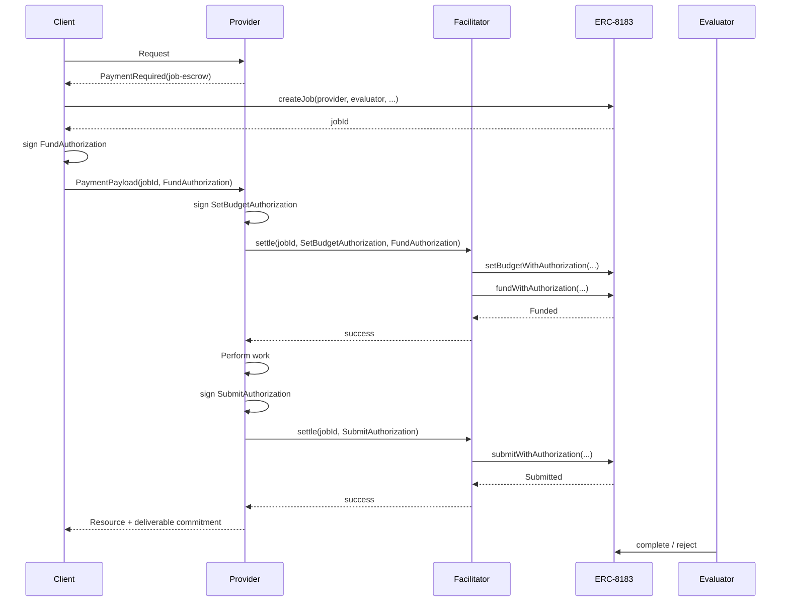

# Scheme: `job-escrow` on `EVM`

## Summary

This is the EVM binding of [`job-escrow`](./scheme_job_escrow.md). It specifies the contract, wire fields, signatures, and facilitator logic that realize the scheme on EVM chains.

The binding builds on [ERC-8183](https://eips.ethereum.org/EIPS/eip-8183) with its Signed Authorizations extension, i.e. an `ERC8183WithAuthorization` deployment. The client creates the job with a direct `createJob` call; every later operation is a `*WithAuthorization` entry point, where the contract verifies an EIP-712 signature from the acting role and executes the core function **with the signer as the acting party**. The facilitator is `msg.sender` of nothing that matters — it pays gas and holds no role.

There is no canonical deployment. ERC-8183 escrows are upgradeable, pausable, admin-configured contracts (fee rates, token allowlist, hook whitelist), so a facilitator advertises the escrows it relays for in `/supported`, and a server MUST name one of them in `extra.escrow`.

## Roles onchain

| Scheme role | ERC-8183 field | Set by | Onchain authentication |
| --- | --- | --- | --- |
| client | `job.client` | `createJob` caller | `FundAuthorization` signer MUST equal `job.client` |
| provider | `job.provider` | client, at `createJob` | `SetBudgetAuthorization` and `SubmitAuthorization` signers MUST equal `job.provider` |
| evaluator | `job.evaluator` | client, at `createJob` | `complete` / `reject` callers MUST equal `job.evaluator` |

The contract enforces `client != provider` and `provider != evaluator`. A resource server therefore **cannot** be its own evaluator, and a client cannot buy from itself.

## Flow



## PaymentRequirements

```json
{
  "x402Version": 2,
  "resource": {
    "url": "https://api.example.com/summarize",
    "description": "Summarize the POSTed document in at most 500 words, preserving all figures and dates."
  },
  "accepts": [
    {
      "scheme": "job-escrow",
      "network": "eip155:8453",
      "amount": "1000000",
      "asset": "0x833589fCD6eDb6E08f4c7C32D4f71b54bdA02913",
      "payTo": "0xProviderAddress",
      "maxTimeoutSeconds": 120,
      "extra": {
        "name": "USD Coin",
        "version": "2",
        "escrow": "0xErc8183EscrowAddress",
        "evaluators": ["0xEvaluatorA", "0xEvaluatorB", "client"],
        "hooks": ["0x0000000000000000000000000000000000000000", "0xReputationHook"],
        "jobExpiresAt": 1740762154,
        "providerAgentId": "0",
        "paymentFlow": "escrow",
        "payoutReceiver": "0xReceiverAddress"
      }
    }
  ]
}
```

`resource.description` is the core `ResourceInfo` field and becomes the job's onchain description, see [Job description](#job-description).

### `extra` fields

| Field | Required | Type | Description |
| --- | --- | --- | --- |
| `name` | No | `string` | EIP-712 token-domain name, for an EIP-2612 `permit`. REQUIRED if the server expects clients without a standing allowance. |
| `version` | No | `string` | EIP-712 token-domain version, for an EIP-2612 `permit`. |
| `escrow` | Yes | `address` | The `ERC8183WithAuthorization` contract. MUST be one the facilitator advertises for this network. |
| `evaluators` | Yes | `string[]` | Non-empty list of evaluators the server accepts, see [Evaluators](#evaluators). Each entry is an address, `"*"`, or `"client"`. Order is the server's preference. |
| `hooks` | No | `string[]` | List of job hooks the server accepts, see [Hooks](#hooks). Each entry is an address (the zero address meaning "no hook") or `"*"`. Default `["*"]`. Order is the server's preference. |
| `jobExpiresAt` | Yes | `uint48` | Absolute Unix seconds; the **floor** for onchain `job.expiredAt`. MUST satisfy `jobExpiresAt > now + maxTimeoutSeconds + 300` (the contract rejects an expiry less than five minutes ahead at creation). |
| `description` | If `resource.description` is absent | `string` | The job brief, see [Job description](#job-description). MUST NOT be present when `resource.description` is. |
| `providerAgentId` | No | `uint256` string | Onchain `job.providerAgentId`, the server's ERC-8004 agent identity. Default `"0"`. |
| `paymentFlow` | Yes | `"escrow"` \| `"upfront"` | `"authorization"` MUST be rejected. |
| `budgetAuthorization` | Settle time only | object | The server's `SetBudgetAuthorization` for the job being settled, see [Provider price commitment](#provider-price-commitment). MUST NOT appear in the 402. |

### Job description

ERC-8183 stores a `description` on every job — "a job brief, scope reference" — set by the client at creation. This binding takes it from the 402 rather than defining a field of its own: the job description is `resource.description` of the `PaymentRequired` (the core [`ResourceInfo`](../../x402-specification-v2.md#5-types) field, "human-readable description of the resource"), and when the server publishes none, `accepts[].extra.description`, which is then REQUIRED. The client MUST pass the resolved value verbatim to `createJob`, and the facilitator checks its hash at verification. It is the brief the evaluator will judge against, so it SHOULD state what the resource delivers in terms a human or an evaluator can check. It is stored onchain at the client's gas cost, so a server SHOULD keep it short, and MAY point to fuller terms by URI within it.

`amount` is the job budget in atomic units and is what the client escrows. Platform and evaluator fees, if the escrow charges them, are deducted from the **payout**, not added to the client's charge; a server reads `platformFeeBP` and `evaluatorFeeBP` from the escrow to know its net.

### Evaluators

`extra.evaluators` names the evaluators the server will serve a job under. The client picks one and commits it at `createJob`; the job's evaluator is checked against the list before funding.

| Entry | `job.evaluator` accepted when |
| --- | --- |
| an address | `job.evaluator == entry` |
| `"client"` | `job.evaluator == job.client` — the client judges its own job |
| `"*"` | any address. The contract already excludes `payTo`. |

The list is ordered: the first entry is the server's preference, and a client SHOULD choose it absent a reason of its own. `"*"` MUST mean what it says: a server advertising it MUST NOT refuse a job on the ground of its evaluator. A server that would refuse some evaluators MUST enumerate the ones it accepts. A server whose acceptable set is not enumerable — because it is defined by a registry, a reputation threshold, or delegation to a routing evaluator — advertises the routing contract's address (see [Evaluator routing](#evaluator-routing-non-normative)), or waits for a registry-valued entry to be defined; it does not advertise `"*"`.

A list is an `accepts[]` entry's constraint, not a menu of entries: each entry remains independently selectable and the client resolves it to one concrete job before anything is signed, exactly as it resolves `upto`'s ceiling to one settled amount. A server that wants to pair different evaluators with different prices or expiries lists several `accepts[]` entries.

### Hooks

ERC-8183 attaches an OPTIONAL per-job hook, chosen by the client at `createJob` from the escrow's admin-managed whitelist; `createJob` reverts `HookNotWhitelisted` otherwise. A hook is client-side policy: it MAY revert `setBudget`, `fund`, or `submit`, and receives `optParams` on each.

`extra.hooks` names the hooks the server will serve a job under, with the same shape and rules as `extra.evaluators`:

| Entry | `job.hook` accepted when |
| --- | --- |
| an address | `job.hook == entry`. The zero address means a job with no hook. |
| `"*"` | any hook the escrow whitelists, including none. |

The default when absent is `["*"]`: naming an escrow accepts every hook it whitelists. A server that lists only the zero address serves unhooked jobs only; a server that lists hooks but not the zero address **requires** one of them. `"*"` MUST mean what it says. In every case the facilitator also confirms `escrow.whitelistedHooks(job.hook)`; that check is defensive, since the job could not otherwise exist, and fails only if the escrow's admin removed the hook after creation.

Hooks consume `optParams`, and every ERC-8183 authorization binds `optParamsHash`. Each authorization this binding carries therefore has an OPTIONAL `optParams` (hex bytes, default `0x`), supplied by the party that signs it: the client's on `fundAuthorization`, the server's on `budgetAuthorization` and `submit`. What a hook expects is documented by the hook, not by this binding.

## Job creation

Before paying, the client calls, from the address it will sign with:

```
escrow.createJob(
  provider        = payTo,
  evaluator       = one of extra.evaluators, resolved as above,
  expiredAt       = >= extra.jobExpiresAt,
  description     = resource.description, or extra.description when that is absent,
  hook            = one of extra.hooks, resolved as above,
  providerAgentId = extra.providerAgentId
)  → jobId
```

The client pays gas for this one call. It moves no funds. A client that lacks a standing allowance of at least `amount` from itself to `escrow` on `asset` either includes `approve(escrow, ≥ amount)` alongside (one-time per token, as Permit2 setup is in `exact`), or signs an EIP-2612 `permit` in the payload.

A created job that is never funded is `Open` and holds nothing. While `Open`, **either the client or the provider** MAY `reject(jobId, reason)` it; otherwise it becomes `Expired` after `expiredAt`, still holding nothing. A server that refuses a job before funding SHOULD `reject` it, so the client's open jobs reflect what can still be funded.

## Provider price commitment

At settle time, the server signs a `SetBudgetAuthorization` over the job the client created, in the escrow's domain:

```
{ name: "ERC8183", version: "1", chainId, verifyingContract: extra.escrow }

SetBudgetAuthorization(address signer,uint256 jobId,address token,uint256 amount,bytes32 optParamsHash,uint72 nonce,uint256 deadline)
```

with `signer = payTo`, `jobId = payload.jobId`, `token = asset`, `amount = amount`, `optParamsHash = keccak256(optParams)`, a fresh `uint72 nonce`, and `deadline <= now + maxTimeoutSeconds`. It is passed to `/settle` as `paymentRequirements.extra.budgetAuthorization`:

```json
"budgetAuthorization": {
  "signer": "0xProviderAddress",
  "nonce": "0x00000000000000000abc",
  "deadline": 1740758274,
  "optParams": "0x",
  "signature": "0x5c1e...9a02"
}
```

It is the settle-time form of the price the 402 advertised. Like `upto`'s settle-time `amount`, it is a field the server adds to the requirements between the 402 and settlement.

A self-facilitating server MAY instead call `escrow.setBudget(jobId, asset, amount, optParams)` directly before `/settle`; the facilitator then finds `job.budget == amount && job.paymentToken == asset` already set and omits the call. A budget set on a job that then fails to fund is harmless: the job is `Open`, and the client's next `fund` for the same terms still matches.

## Client payment payload

The client names no operation; the payload settles as `fund` under both flows.

```json
{
  "x402Version": 2,
  "resource": { "url": "https://api.example.com/resource", "method": "POST" },
  "accepted": { "scheme": "job-escrow", "...": "..." },
  "payload": {
    "jobId": "4821",
    "fundAuthorization": {
      "signer": "0xClientAddress",
      "nonce": "0x0000000000000000f00e",
      "deadline": 1740758274,
      "optParams": "0x",
      "signature": "0x8b04...c3e1"
    },
    "permit": {
      "value": "1000000",
      "deadline": 1740758274,
      "signature": "0x71aa...0d5f"
    }
  }
}
```

| Payload field | Derived from |
| --- | --- |
| `jobId` | The id returned by the client's `createJob`, as a decimal string. |
| `fundAuthorization` | `FundAuthorization(signer, jobId, expectedToken = asset, expectedBudget = amount, optParamsHash = keccak256(optParams), nonce, deadline)` in the escrow's domain. |
| `fundAuthorization.signer` | `job.client` — the address that called `createJob`. ERC-1271 signers are valid (the escrow uses `SignatureChecker`). |
| `fundAuthorization.nonce` | Fresh random `uint72`; single-use across all ERC-8183 actions for this signer on this escrow. |
| `fundAuthorization.deadline` | `<= now + maxTimeoutSeconds` |
| `fundAuthorization.optParams` | OPTIONAL, default `0x`. Bytes for the job's hook on `fund`. |
| `permit` | OPTIONAL. EIP-2612 `Permit(owner = signer, spender = extra.escrow, value >= amount, nonce = token.nonces(owner), deadline)` in the token's domain `{ name, version, chainId, verifyingContract = asset }`. Omitted when `token.allowance(signer, escrow) >= amount`. |

`fundAuthorization` is both the payment and the proof: `fundWithAuthorization` reverts `Unauthorized` unless `signer == job.client`, so a `jobId` observed onchain cannot be presented by anyone but the address that created it.

## Lifecycle payload: `submit`

Under `escrow`, the second `/settle` carries the server-authored `submit`:

```json
{
  "x402Version": 2,
  "accepted": { "scheme": "job-escrow", "...": "..." },
  "payload": {
    "type": "submit",
    "jobId": "4821",
    "deliverable": "0x3fa1...77c9",
    "deliverableMethod": "keccak256-body",
    "submitAuthorization": {
      "signer": "0xProviderAddress",
      "nonce": "0x00000000000000000abd",
      "deadline": 1740758874,
      "optParams": "0x",
      "signature": "0x44d0...e6b3"
    }
  }
}
```

`submitAuthorization` is `SubmitAuthorization(signer = payTo, jobId, deliverable, optParamsHash = keccak256(optParams), nonce, deadline)` in the escrow's domain. `payload.type` appears only here.

### Deliverable

`deliverable` is the `bytes32` the provider commits to on `submit`; `deliverableMethod` names how the provider derived it. Both travel together: to the facilitator in the `submit` payload, and back to the client under `extensions["job-escrow"]` of the settlement response (see [SettlementResponse](#settlementresponse)), because under `escrow` the `submit` settle completes before the response is sent. The client can then recompute the commitment from what it received, and later hand the delivered work and the method to the evaluator, who compares against the onchain value; the evaluator needs nothing from the 402. Under `upfront` the server submits out of band; the client observes `JobSubmitted(jobId, provider, deliverable)` on the escrow and learns the method from the server's own API.

| `deliverableMethod` | `deliverable` |
| --- | --- |
| `"keccak256-body"` | `keccak256` of the exact response body bytes, before any transport encoding. The default for a single-body response. |
| any other string | Provider-defined. The provider MUST document it where its clients can find it. A client that does not recognize the method cannot verify the commitment locally and SHOULD treat the response accordingly. |

`deliverableMethod` MUST be present on every `submit` payload and in every settlement response that carries `deliverable`. This binding defines only `"keccak256-body"`; a server whose delivery is not a single body (streams, empty bodies, side effects) uses a method of its own.

## Verification

### Common

1. **Scheme match**: `requirements.scheme` and `payload.accepted.scheme` are both `job-escrow`.
2. **Extra validation**: `extra.escrow` is advertised for this network; `extra.evaluators` is non-empty and every address entry is non-zero and `!= payTo`; `jobExpiresAt > now + maxTimeoutSeconds + 300`; `paymentFlow` is `escrow` or `upfront`.
3. **Escrow state**: `escrow.paused() == false`; `escrow.allowedPaymentTokens(asset) == true`.

### `fund` — facilitator, at `/settle`

Both flows of this scheme omit `/verify` from their ordering: the first `/settle` is the pre-resource check. A server MAY nevertheless call `/verify` first as a read-only pre-check — in particular to learn whether it will serve the job before signing a `SetBudgetAuthorization` and spending a nonce on it. `/verify` runs steps 1–8, 10, and 11 below; `/settle` runs them all.

4. **Shape guard**: `jobId` and `fundAuthorization` present; `permit` present or `token.allowance(signer, escrow) >= amount`.
5. **Job exists**: `1 <= jobId <= escrow.jobCounter()`; read `job = escrow.getJob(jobId)`.
6. **Job matches the offer**: `job.client == fundAuthorization.signer`; `job.provider == payTo`; `job.evaluator` is accepted by `extra.evaluators` per [Evaluators](#evaluators); `job.hook` is accepted by `extra.hooks` per [Hooks](#hooks) and `escrow.whitelistedHooks(job.hook) == true`; `keccak256(job.description) == keccak256(resolved description)` per [Job description](#job-description); `job.providerAgentId == extra.providerAgentId`; `job.expiredAt >= extra.jobExpiresAt`.
7. **Job state**: `job.status == Open`; `job.expiredAt > now + maxTimeoutSeconds`; `job.paymentToken` is `address(0)` or `asset`; `job.budget` is `0` or `amount`.
8. **Fund authorization**: signature recovers (ECDSA or ERC-1271) to `signer` over the `FundAuthorization` digest built from `(jobId, asset, amount, keccak256(optParams), nonce, deadline)`; `deadline > now`; `escrow.authorizationNonceUsed(pack(signer, nonce)) == false`.
9. **Budget authorization** (`/settle` only): `extra.budgetAuthorization` recovers to `payTo` over `(jobId, asset, amount, keccak256(optParams), nonce, deadline)`; nonce unused; `deadline > now`. Skipped when step 7 found the budget already set.
10. **Permit**: if present, recovers to `signer` over the token's `Permit` digest with `spender == escrow`, `value >= amount`, `nonce == token.nonces(signer)`, `deadline > now`.
11. **Balance**: `token.balanceOf(signer) >= amount`.
12. **Simulation** (`/settle` only): simulate the settlement batch below and confirm `BudgetSet(jobId, asset, amount)` (unless already set) and `JobFunded(jobId, signer, amount)` are emitted by `extra.escrow`, and that `getJob(jobId).status == Funded` afterwards. A hooked job's `beforeAction` / `afterAction` run inside this simulation; a reverting hook is reported as `invalid_job_escrow_evm_hook_reverted`.

### `submit` — facilitator

1. `payload.type == "submit"`; `jobId`, `deliverable != bytes32(0)`, `deliverableMethod` non-empty, `submitAuthorization` present.
2. `submitAuthorization` recovers to `payTo` over the `SubmitAuthorization` digest with `optParamsHash = keccak256(optParams)`; nonce unused; `deadline > now`.
3. `getJob(jobId)`: `provider == payTo`, `status == Funded`, `expiredAt > now`.

## Settlement

### `fund`

The facilitator submits one atomic batch, in this order:

```
[ token.permit(signer, escrow, value, deadline, v, r, s) ]                                       // only if payload.permit present
[ escrow.setBudgetWithAuthorization(jobId, asset, amount, budgetAuthorization.optParams, budgetAuthorization) ]   // unless already set
escrow.fundWithAuthorization(jobId, asset, amount, fundAuthorization.optParams, fundAuthorization)
```

None of these calls reads `msg.sender` for authorization, so the batch MAY go through the canonical Multicall3 `aggregate3` with `allowFailure = false`, or through any facilitator-controlled batcher. The facilitator SHOULD NOT submit the calls as separate transactions; a partial landing is safe for the client (the job stays `Open` and its `fund` nonce unused) but burns the server's budget nonce for nothing. The facilitator MUST cap the batch's gas, since a hook runs inside it.

After confirmation the facilitator MUST apply the step-12 outcome checks to the receipt and resulting state, and only then report success. It returns a `SettlementResponse` with `success = true`, `transaction` = the batch transaction hash, `network`, `payer = signer`, and `amount`.

### `submit`

The facilitator submits `escrow.submitWithAuthorization(jobId, deliverable, submitAuthorization.optParams, submitAuthorization)`, confirms `JobSubmitted(jobId, payTo, deliverable)`, and returns a `SettlementResponse` with `transaction` and the `job-escrow` extension object below carrying `deliverable` and `deliverableMethod` echoed from the payload.

### After settlement

`complete` and `reject` are the evaluator's. `claimRefund(jobId)` is permissionless once `now >= expiredAt` (`Funded`) or `now >= expiredAt + EVALUATION_GRACE_PERIOD` (`Submitted`, one hour in the reference implementation) and pays the client. None of these is a `/settle` operation.

## SettlementResponse

The [`SettlementResponse`](../../x402-specification-v2.md#53-settlementresponse-schema) is the core type unchanged. Scheme-specific data travels under its `extensions` field, keyed `"job-escrow"`:

```json
{
  "success": true,
  "transaction": "0x7c21...e0a4",
  "network": "eip155:8453",
  "payer": "0xClientAddress",
  "extensions": {
    "job-escrow": {
      "deliverable": "0x3fa1...77c9",
      "deliverableMethod": "keccak256-body"
    }
  }
}
```

| `extensions["job-escrow"]` field | Type | Required | Description |
| --- | --- | --- | --- |
| `deliverable` | `string` | On `submit` | The committed `bytes32`. |
| `deliverableMethod` | `string` | With `deliverable` | How `deliverable` was derived, see [Deliverable](#deliverable). |

The `fund` settlement carries no extension object: the client already knows `jobId` and `escrow`, having created the job. Under `escrow` the server's 200 carries the `submit` settlement's response in `PAYMENT-RESPONSE`, so the client receives the commitment with the body; it SHOULD recompute `deliverable` from the body per `deliverableMethod` and keep the body if the two match, since body plus method is the evidence the evaluator will compare against the chain. Under `upfront` the 200 carries the `fund` settlement's response and no deliverable.

## `/supported`

```json
{
  "kinds": [
    {
      "x402Version": 2,
      "scheme": "job-escrow",
      "network": "eip155:8453",
      "extra": {
        "escrows": ["0xErc8183EscrowAddress"]
      }
    }
  ],
  "signers": { "eip155:*": ["0xFacilitatorSignerAddress"] }
}
```

`extra.escrows` is the allowlist of `ERC8183WithAuthorization` deployments the facilitator relays into. Because an ERC-8183 escrow is upgradeable and pausable by its admin, admission is a review of the deployment and its admin, not of the code alone.

## Error Codes

Every reason this binding defines is namespaced `invalid_job_escrow_evm_*`; standard reasons keep their canonical names.

| Error | Meaning |
| --- | --- |
| `invalid_job_escrow_evm_extra` | A required `extra` field is missing or malformed, `evaluators` is empty or has a zero / `payTo` address entry, `hooks` is present and empty, no job description resolves, `paymentFlow` is `authorization`, or `budgetAuthorization` appears at `/verify`. |
| `invalid_job_escrow_evm_escrow_not_supported` | `extra.escrow` is not one the facilitator advertises for this network. |
| `invalid_job_escrow_evm_escrow_paused` | The escrow is paused. |
| `invalid_job_escrow_evm_token_not_allowed` | `asset` is not on the escrow's payment-token allowlist. |
| `invalid_job_escrow_evm_evaluator_not_accepted` | `job.evaluator` matches no entry of `extra.evaluators`. |
| `invalid_job_escrow_evm_hook_not_accepted` | `job.hook` matches no entry of `extra.hooks`. |
| `invalid_job_escrow_evm_hook_not_whitelisted` | `job.hook` is no longer on the escrow's hook whitelist. |
| `invalid_job_escrow_evm_hook_reverted` | The job's hook reverted in simulation or on chain. |
| `invalid_job_escrow_evm_expiry_too_soon` | `jobExpiresAt` does not clear `now + maxTimeoutSeconds + 300`, or `job.expiredAt` is below the offered floor or too close to now. |
| `invalid_job_escrow_evm_job_not_found` | `jobId` is out of range on the escrow. |
| `invalid_job_escrow_evm_client_mismatch` | `job.client` is not `fundAuthorization.signer`. |
| `invalid_job_escrow_evm_job_mismatch` | A stored job field (provider, description, agent id, token, budget) does not match the requirements. |
| `invalid_job_escrow_evm_wrong_status` | The job is not in the state the operation needs. |
| `invalid_job_escrow_evm_authorization_signature` | A `*Authorization` signature does not recover to the required signer. |
| `invalid_job_escrow_evm_authorization_nonce_used` | An authorization nonce is already used or cancelled. |
| `invalid_job_escrow_evm_authorization_expired` | An authorization or permit `deadline` has passed. |
| `invalid_job_escrow_evm_insufficient_allowance` | No `permit` and `allowance(signer, escrow) < amount`. |
| `invalid_job_escrow_evm_insufficient_balance` | `balanceOf(signer) < amount`. |
| `invalid_job_escrow_evm_budget_authorization_missing` | `/settle` for a job whose budget is unset, with no `extra.budgetAuthorization`. |
| `invalid_job_escrow_evm_payload_type` | A lifecycle payload's `type` is not `submit`. |
| `invalid_job_escrow_evm_deliverable_empty` | `deliverable` is `bytes32(0)`, or `deliverableMethod` is missing or empty. |
| `invalid_job_escrow_evm_unexpected_outcome` | The simulated or confirmed batch did not emit the expected events or leave the job in the expected state. |

### Contract reverts

| ERC-8183 revert | Reported as |
| --- | --- |
| `InvalidJob` | `invalid_job_escrow_evm_job_not_found` |
| `WrongStatus` | `invalid_job_escrow_evm_wrong_status` |
| `Unauthorized` | `invalid_job_escrow_evm_client_mismatch` (fund) / `invalid_job_escrow_evm_job_mismatch` (setBudget, submit) |
| `BudgetMismatch`, `PaymentTokenMismatch` | `invalid_job_escrow_evm_job_mismatch` |
| `PaymentTokenNotAllowed` | `invalid_job_escrow_evm_token_not_allowed` |
| `ProviderNotSet` | `invalid_job_escrow_evm_job_mismatch` |
| `HookNotWhitelisted` | `invalid_job_escrow_evm_hook_not_whitelisted` |
| revert bubbled from a hook | `invalid_job_escrow_evm_hook_reverted` |
| `AuthorizationExpired` | `invalid_job_escrow_evm_authorization_expired` |
| `AuthorizationNonceUsed` | `invalid_job_escrow_evm_authorization_nonce_used` |
| `InvalidAuthorizationSignature` | `invalid_job_escrow_evm_authorization_signature` |
| `UnexpectedFundedAmount` | `invalid_job_escrow_evm_unexpected_outcome` |
| `EnforcedPause` | `invalid_job_escrow_evm_escrow_paused` |

## Security Considerations

- **The facilitator holds no role.** Every call it submits is verified onchain against the signer of a role-bound authorization. It cannot fund, submit, complete, reject, or redirect. Its only failure modes are not relaying and paying gas for a revert.
- **The evaluator is trusted by both sides.** The server accepts it by listing it (or `"*"`) and bears the risk that it never completes: after `jobExpiresAt` (+ grace once submitted) anyone can `claimRefund` and the client gets its escrow back regardless of delivery. The client chooses it and bears the risk that it completes bad work. Neither can be the provider. A server advertising `"*"` accepts that a client may name an evaluator that never acts; a server that wants no third party can only be paid by an evaluator the client trusts, and a client that wants no third party needs a server that lists `"client"`.
- **A hook is client policy the server has agreed to.** By listing a hook, or `"*"`, the server accepts it. A hook MAY revert `submit` until the job expires, after which `claimRefund` returns the escrow to the client and the provider is unpaid — the same shape as a dead evaluator, and the same answer: the server listed it. A server that does not want that exposure lists the zero address alone. The default `["*"]` is the permissive choice; a server that omits `hooks` SHOULD know what its escrow whitelists.
- **The escrow's admin is a trusted party.** `ERC8183` is a UUPS proxy with `pause`, `emergencyWithdraw` while paused, fee setters, and the token and hook allowlists. Facilitators, servers, and clients MUST treat admission of an escrow as trust in that admin.
- **Funded before execution.** Both defined flows establish `Funded` before the resource runs. An `authorization` ordering would instead have the provider work against a `FundAuthorization` that has been verified but not executed, and which may expire, be cancelled by its signer, or otherwise become unexecutable before settlement; the corresponding settle would have to land `setBudget`, `fund`, and `submit` in one batch afterwards. This version does not define it.
- **Nothing strands before funding.** A created job holds no funds; the client or the provider may `reject` it while `Open`. The client's only sunk cost for a payment that never settles is the gas of `createJob`.
- **The job is the offer, verified.** Because the client creates the job, every field the server relies on — provider, evaluator, hook, description, expiry — is re-read from the chain and checked against the offer before funding. A job created with other terms is refused; it cannot be funded under this offer.
- **Deliverable binding.** `submit` commits the hash the provider claims for its delivery, and the client receives that hash and its method with the response. A server that responds with one body and commits the hash of another leaves the client holding a body that does not match the chain under the server's own stated method — evidence it can carry to the evaluator. Adjudicating it is the evaluator's, not x402's. A server that names an unrecognizable method denies the client local verification, which the client can weigh when choosing servers.
- **`submittedAt` binding.** ERC-8183 binds `submittedAt` into `Complete` and `Reject` authorizations, so a pre-signed terminal action cannot be replayed against a later submission. Not an x402 operation, but the reason relayed evaluator actions would be safe if a facilitator chose to offer them.
- **Description size.** The resolved description is stored onchain by the client's `createJob`. A long `resource.description` raises the client's gas for every job; a server SHOULD keep it to a short brief.

## Appendix

### PaymentRequirements → Job

| `PaymentRequirements` | `Job` | Set at |
| --- | --- | --- |
| `payTo` | `provider` | `createJob` |
| one of `extra.evaluators` | `evaluator` | `createJob` |
| `extra.jobExpiresAt` (floor) | `expiredAt` | `createJob` |
| `resource.description`, else `extra.description` | `description` | `createJob` |
| `extra.providerAgentId` | `providerAgentId` | `createJob` |
| one of `extra.hooks` | `hook` | `createJob` |
| — | `client = msg.sender` | `createJob` |
| `asset` | `paymentToken` | `setBudget` |
| `amount` | `budget` | `setBudget` |
| — | `payoutReceiver = address(0)` (payouts to `provider`) | — |

### EIP-712 types used

Escrow domain: `{ name: "ERC8183", version: "1", chainId, verifyingContract: escrow }`.

```
SetBudgetAuthorization(address signer,uint256 jobId,address token,uint256 amount,bytes32 optParamsHash,uint72 nonce,uint256 deadline)
FundAuthorization(address signer,uint256 jobId,address expectedToken,uint256 expectedBudget,bytes32 optParamsHash,uint72 nonce,uint256 deadline)
SubmitAuthorization(address signer,uint256 jobId,bytes32 deliverable,bytes32 optParamsHash,uint72 nonce,uint256 deadline)
```

`optParamsHash` is `keccak256(optParams)`, `keccak256("")` when omitted. Nonces are packed onchain as `bytes32((uint256(uint160(signer)) << 96) | uint256(nonce))` and checked via `authorizationNonceUsed(bytes32)`.

### Evaluator routing (non-normative)

An evaluator MAY be a contract that itself decides which of several judges to consult — a marketplace, a committee, a reputation-weighted pool. To this binding it is one address in `extra.evaluators`; how the client and the routing contract agree on a particular judge is outside x402, and MAY travel in the job's hook `optParams` if the routing contract is also the hook. Entries that gate acceptance on an external registry (for example `"registry:0x…"` resolved through an `isAccepted(address)` view) are a plausible future value of `extra.evaluators`, not defined here.

### Delegated provider (non-normative)

A facilitator could stand in as `provider` — `payTo` set to a facilitator address, `payoutReceiver` set to the server before funding, the server verifying that onchain before serving — the way `auth-capture`'s `"delegated"` operator stands in for the receiver. This binding does not define it. The reason `auth-capture` needs delegation is that its operator must *submit transactions*: gas, nonces, an RPC. Here the server submits nothing; it signs two EIP-712 messages, which is what the `*WithAuthorization` extension exists to make sufficient. Against no motivation stands a real cost: `provider` is the accountable party in ERC-8183 — `providerAgentId`, reputation writes, and the `provider != evaluator` rule all key on it — and a stand-in blurs who did the work. If a class of servers that cannot hold a signing key turns up, this is the shape to revisit.

### Gasless job creation (non-normative)

`createJobWithAuthorization` exists, but a `FundAuthorization` binds `jobId`, which is assigned only when creation lands. A fully gasless collect therefore needs either a second round trip (client sends `createJobAuthorization`; the facilitator lands it; the server answers 402 again with `extra.jobId`; the client sends `fundAuthorization`) or a predicted `jobId`, which fails under any contention. Neither is specified here. A creation-time price path in ERC-8183 — a `createJob` variant taking `(token, budget)` with the provider's signature over them, moving straight to `Funded` — would make a gasless one-round-trip collect possible; the 402 already is the provider's price proposal.

## Version History

| Version | Date | Changes | Authors |
| --- | --- | --- | --- |
| v0.1 | 2026-09-24 | Initial draft | — |

